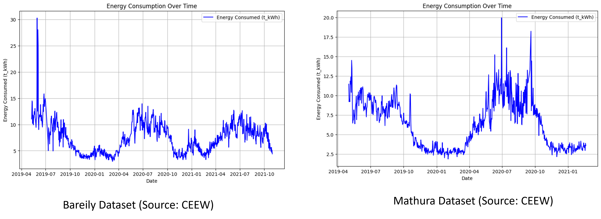

# Dataset Preparation

Dataset Link : https://drive.google.com/drive/folders/1SslN-ujkFrNzi0DLKHrvBVTIcRDKyGt2?usp=sharing

# Here are key slides from the presentation:

### Feature Combination

    

### Training-testing setup

    

### Full data

    

### Predictions

    

    

# Project Documentation

For more details, check out the presentation:

[Download the PowerPoint Presentation](final_project_Aditya_Yuvraj.pptx)
