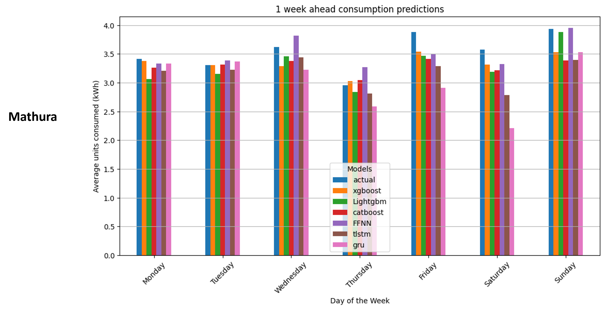

# Dataset Preparation

### Dataset Link
[Download the dataset](https://drive.google.com/drive/folders/1SslN-ujkFrNzi0DLKHrvBVTIcRDKyGt2?usp=sharing)

To set up the dataset:
1. Download the **B - Bareilly** folder and **M - Mathura** folder from the provided link.
2. Place both folders into the `dataset preparation` directory.
3. Ensure the dataset is ready before running the main script.

---

# Key Slides from the Presentation

### Feature Combination

    

### Training-Testing Setup

    

### Full Dataset Overview

    

### Predictions
#### Prediction Visualization 1

    

#### Prediction Visualization 2

    

---

# Project Documentation

For more details, check out the presentation:

[Download the PowerPoint Presentation](final_project_Aditya_Yuvraj.pptx)

---

- For additional instructions or details, refer to the project documentation.
